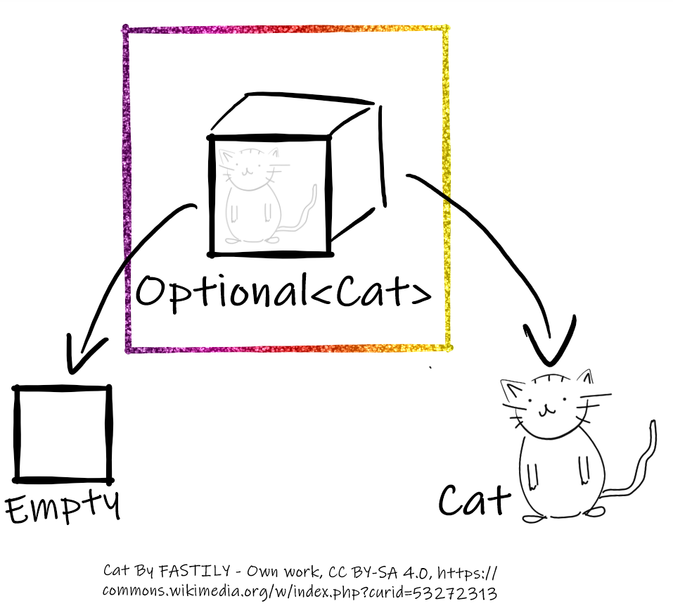

# Intro
Hi, i’m Johannes and I’m a software developer. Some time ago, a colleage asked me, why I used a Java class called “Optional”. So I told him and I thought to myself: Johannes, you should tell people about this beautiful piece of code. 
Well, that’s what I’m going to do.

# Overview
It’s basically just a container, that holds a single object. And this object can either be null or not null.

The contained Object class is defined through the Generic “T”.

See [UsageExample](src/main/java/de/johannes_rabauer/optionals/UsageExample.java)
 

# “Why is this useful?” you ask.
Well it helps to show intent.
If you see a Optional-object anywhere, it is clear, that there might be nothing in it. It could be empty or there could be something inside. Either way it is easy to find out and handle it accordingly.
And through this it makes code more readable. And that’s what it’s all about, isn’t it?

See [Comparison](src/main/java/de/johannes_rabauer/optionals/Comparison.java)
Of course you can still misuse Optional and return null instead of Optional.empty(), but
this would be a very conscious decision for a developer.

# Initialisation
There are multiple ways to create an Optional-Object.
I find the `ofNullable` call to be the most useful for me. You simply call
`Optional.ofNullable(someObject)`
and someObject is wrapped in an Optional. Whether it is null or not.
You can also create a Not-Null-Optional by calling `Optional.of(someObject)` whereas the someObject must not be null.
Or you call `Optional.empty()` to create an empty Optional-Instance.

# Further usage
Now that we have created these Optional-Objects, we can read them in a lot of different ways.
The simplest calls are `.get()` and `isEmpty()` which work exactly as one would think.
`get()` returns the content or, if empty, throws an exception.
`isEmpty()` tells the caller if there is any content in the Optional or not.

Another way would be to simply call `.orElse(placeholder)`
This way we can get the content of the Optional-Object, or, if it does not have any content, the placeholder object.
So we have a very clear and compact way to say: Give me the queried object, or an alternative. 
This is way better to read then:

		Object result = object;
		if(result == null)
		{
			result = placeholder;
		}

Lastly i want to point out `ifPresent(Conusmer)` where can execute some action,
only if there is any content in the Optional-Object.

## Stream
Since Java 9 the `stream` methode was added. With that you can easily map Optional of a stream.
See [BurgerExample](src/main/java/de/johannes_rabauer/optionals/BurgerExample.java)

# What I did
Sounds like fun, right?
Well, if you are a child at heart, like me, you learn some new technique or feature and everywhere you look, you’ll see use-cases. So that’s what I did.
I used Optionals as Parameters, as return-values and within methods. I sent Optionals over the networks, I persisted them in databases. 
It was wonderful. – No, it wasn’t.
There are several Problems when using Optionals:
## Problem 1: Generic
See [OverloadExample](src/main/java/de/johannes_rabauer/optionals/OverloadExample.java)

It’s not possible to overload a method with generics because of type erasure.
[https://stackoverflow.com/questions/7201231/java-erasure-with-generic-overloading-not-overriding](https://stackoverflow.com/questions/7201231/java-erasure-with-generic-overloading-not-overriding)

## Problem 2: No Serialisation
Since Optional was only designed to be used as a return value, the java expert group decided to not put any more then the bare necessities in the class. Which excludes being serializable.
[https://stackoverflow.com/a/24564612/2351407](https://stackoverflow.com/a/24564612/2351407)

# Conclusion
Optionals can make your code more readable. But there a few banana peels along the way. 

Thanks for watching and optionally: have fun!